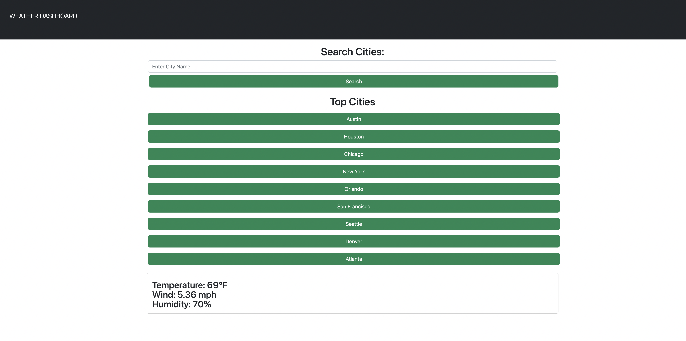

# Weather Dashboard 

## Project Description 

In this project, we are creating a weather dashboard using a Server Side API called [OpenWeather One Call API](https://openweathermap.org/api/one-call-api). We are using localstorage to store data and HTML, JS and CSS for front-end functionationality.

## User Story 

- GIVEN a weather dashboard with form inputs WHEN I search for a city THEN I am presented with current and future conditions for that city and that city is added to the search history
- WHEN I view current weather conditions for that city THEN I am presented with the city
name, the date, an icon representation of weather conditions, the temperature, the humidity, the wind speed, and the UV index
- WHEN I view the UV index THEN I am presented with a color that indicates whether the conditions are favorable, moderate, or severe
- WHEN I view future weather conditions for that city THEN I am presented with a 5-day forecast that displays the date, an icon representation of weather conditions, the temperature, the wind speed, and the humidity
- WHEN I click on a city in the search history THEN I am again presented with current and future conditions for that city

## Acceptance Criteria 

- GIVEN a weather dashboard with form inputs WHEN I search for a city THEN I am presented with current and future conditions for that city and that city is added to the search history
- WHEN I view current weather conditions for that city THEN I am presented with the city name, the date, an icon representation of weather conditions, the temperature, the humidity, the wind speed, and the UV index
- WHEN I view the UV index THEN I am presented with a color that indicates whether the conditions are favorable, moderate, or severe
- WHEN I view future weather conditions for that city THEN I am presented with a 5-day forecast that displays the date, an icon representation of weather conditions, the temperature, the wind speed, and the humidity
- WHEN I click on a city in the search history THEN I am again presented with current and future conditions for that city

## Screenshot 

## Ongoing Work

- Working On HTML
- Fix Form Handler 
- Fix UV functionality
- Add Icons 

## Links 
[DEPLOYED] (https://anjulituck.github.io/weatherdash/)

[REPO](https://github.com/anjulituck/weatherdash)